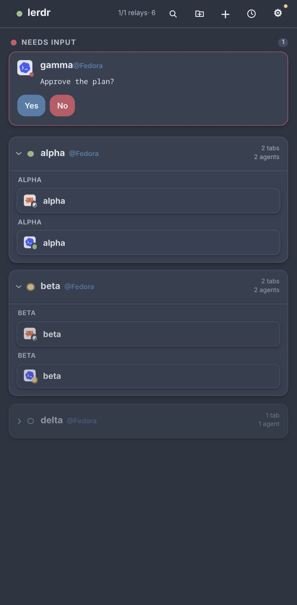
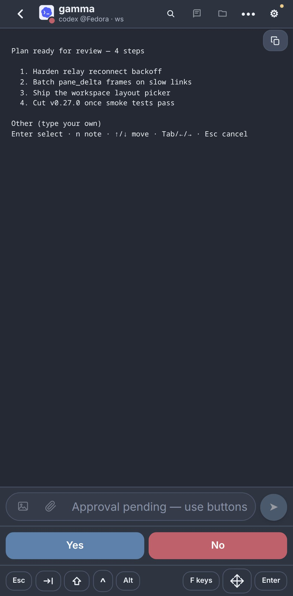
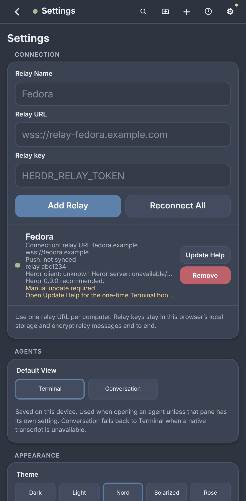

# Lerdr

Lerdr is the mobile companion for [Herdr](https://herdr.dev) coding agents —
your agents, in your pocket. Each Linux or macOS computer runs its own relay;
the app connects to all of them and merges every agent into one place:
prompts, approvals, plan questions, terminal output, and notifications. Ships
as a signed Android APK and as an installable PWA everywhere else.

## Install

1. **Phone**: get `lerdr-*-arm64.apk` from
   [Releases → latest](https://github.com/IGUNUBLUE/lerdr/releases/latest)
   (sideload it, or add the repo to [Obtainium](https://obtainium.imranr.dev/)
   for updates; other ABIs ship in the same release, verify against
   `apk-checksums.txt`). iOS and browsers use the same app as a PWA served by
   the relay itself.
2. **Computer**: `herdr plugin install IGUNUBLUE/lerdr` — needs Herdr 0.7.5+
   (0.9.0 recommended), Git, `curl`; Linux or macOS.
3. **Pair**: pick a transport in the setup menu — the phone app cannot reach
   the relay without one. **Tailscale Serve** (tailnet-only; see
   [docs/tailscale.md](docs/tailscale.md) for its requirements) or **Community
   WebRTC Gateway** (no account) are the recommended paths; Cloudflare tunnels
   and self-hosted gateways work too — then scan the printed QR from the app's
   Settings.

[QUICKSTART.md](QUICKSTART.md) has pairing detail and troubleshooting.

## What you get

| Agents | Terminal | Settings |
| --- | --- | --- |
|  |  |  |

The Android app renders this same UI in its native shell — the screenshots
above are the PWA at a phone viewport. Regenerate them with
`bun scripts/capture-screenshots.ts` from `frontend/`.

- Monitor and control agents across several computers, grouped by status and
  workspace, with agents that need input pinned on top.
- Answer approvals and plan questions from Codex, Claude Code, Devin, Hermes,
  Qoder, OpenCode, Oh My Pi, and Pi.
- Send prompts, terminal keys, and slash commands; attach screenshots, photos,
  and documents in cancellable batches.
- Read and search each agent's native conversation; inspect workspace files,
  images, and Git diffs read-only.
- Manage workspaces and Git worktrees; start, rename, clear, and stop agents.
- Have the relay read responses aloud, even with the screen off.
- Pair every phone as its own named device — controller or read-only reader —
  and revoke any of them.
- On Android: QR and clipboard pairing, native notifications, biometric lock,
  and haptics.

## Documentation

[Feature tour](docs/mobile-app.md) ·
[Android build & sign](docs/android-tauri.md) ·
[Transports](docs/transports.md) · [Tailscale](docs/tailscale.md) ·
[Security](docs/security.md) · [Development](docs/development.md) ·
[Changelog](CHANGELOG.md)

Everything between phone and relay is encrypted end to end; tunnels and
gateways see connection metadata only, never plaintext. Paired devices are
controller or read-only reader, mutations default to controller-only.
[Details →](docs/security.md)

## Acknowledgments

Lerdr began as a fork of
[`0cv/herdr-mobile-relay`](https://github.com/0cv/herdr-mobile-relay) by
**Christophe Vidal** — thank you for the relay architecture, the end-to-end
pairing model, the plugin packaging and verified-release flow, and the phone
UI this project builds on. The changelog's history through v0.21.3 is
upstream's work as well.

Lerdr has since diverged — Tauri 2 Android shell, signed APK releases,
Tailscale Serve transport, native notifications, haptics, and biometrics —
and is maintained independently. If you only need the web-app relay without
the Android shell, upstream may serve you better; please consider starring
and contributing to both projects.

The AGPL license below carries the upstream copyright forward; see
[NOTICE](NOTICE) for attribution details.

## License

[GNU Affero General Public License v3.0 or later](LICENSE).
